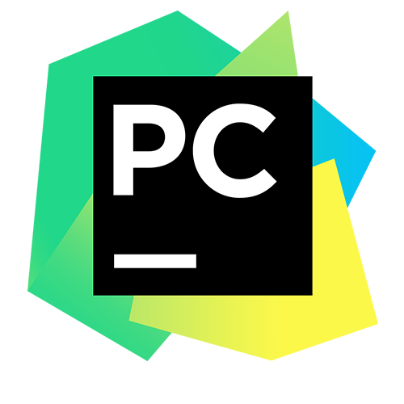

## Привет, я Похиленко Самсон!

Пишу этот `README.md`, чтобы вы, прекрасные люди, читающие мое резюме, порадовались, что я специально для вас посидел вечерок, понаводил тут красоту.

Перед началом знакомства выделю смешливое определение понятию DevOps: 
**Девопс — это собака-программист!** 

Во многом это и определит происходящее дальше. ⚡ Погнали. 

### Технический стэк
Шаблонизатор Jinja и фреймворк Django — это самый лучший симбиоз, который можно было придумать в мире backend. Python — это моя сила и мудрость.

Я мог бы закосить под очередного Python junior Dev, но, вынужден признаться, у меня очень серьезный опыт работы DevOps в ansible, я работал всего год, но работал каждый день, каждый день я администрировал десяток клиентов, решал задачи в bitrix, и раскатывал сервера новых клиентов.

Помимо работы с серверной частью web-приложений, на индивидуальных основах занимался разработкой под Desktop Windows/Linux на примере Tkinter или Qt (с ним я познакомился еще задолго до того, как открыл для себя python, писал на с#). Затем я открыл для себя PySimpleGUI, и решил, что для собственых нужд этого будет достаточно.

Я исключитьельно разобрался в построении архитектуры приложения, с разработкой его бизнесс-логики, и в применении методологии "Бритва Оккама". То есть backend веб-приложений и подкапотная window applications (или консольных) это для меня пройденнный мотериал. Я заявляю, стэк у меня есть, и он вполне серьезный как для dev, но это — дополнительные инструменты и знания для расширения предполагаемых возможностей как DevOps Инженера. Стоит понимать это именно так.
 

 
 
 
 
 
 
 
  
 
 
 

### Решать сложности, а не создавать их, ориентир на модульность
В совершенно любой среде для виртуализации, если речь идет о полноценных серверах, или я нахожусь в стадии проектирования, я использую Hyper-V, VBox, реже в этих целях docker. Docker больше подходит для микросервисов. Удобнее всего собирать микросервисы на GNU/Linux, но работаь удобнее все-таки из привычного окна.
 

 
 
 
 
 
 

### Continuous Integration, Continuous Delivery
Есть особенные клиенты, есть козенные демо-сервера — на них обязательно должны быть прошедшие тестирование последние версии всех модулей!

 
 

### Если можно собрать все, в чем я хорошо разбираюсь, и наполнить этим отдельный блок, то это был бы именно он!
Какому девопс не приходилось администрировать HTTP сервер? Так я хочу продемонтрировать то многообразие технологий, без которых современный программист или девопс выглядит неполноценным.

Приходилось ли вам настраивать SSL на коммерческом VPN хосте? А мне приходилось! Может вы имели дело с клиентским сервером без curl и wget, и вам приходилось использовать telnet? И обнаружить, что, оказываеся, telnet — это мощный и востребованный инструмент в мире B2B решений.

 
 
 
 
 
 
 
 

### Есть вещи, которыми я занимался на досуге или был счастлив (по принуждению) в их освоении
Здесь речь пойдет о студенческих годах или о каких-то впрямь узких задачах, когда написать форк на Go — быстрее и лучше, чем изобретать свой велосипед. Так было с экспоретором для репликации БД MySQL для prometheus.

 
 
 

## Важно всегда наверняка знать, в каком состоянии сейчас находятся десятки или сотни серверов
Поэтому мониторинги занимают такое же важное место, как и те технологии, которые мы отслеживаем. Лучшим стэком по критериям масштабируемости и скорости развертки, являются Prometheus + Grafana.

 
## 📫 Способы для связи

 
 
 
 

